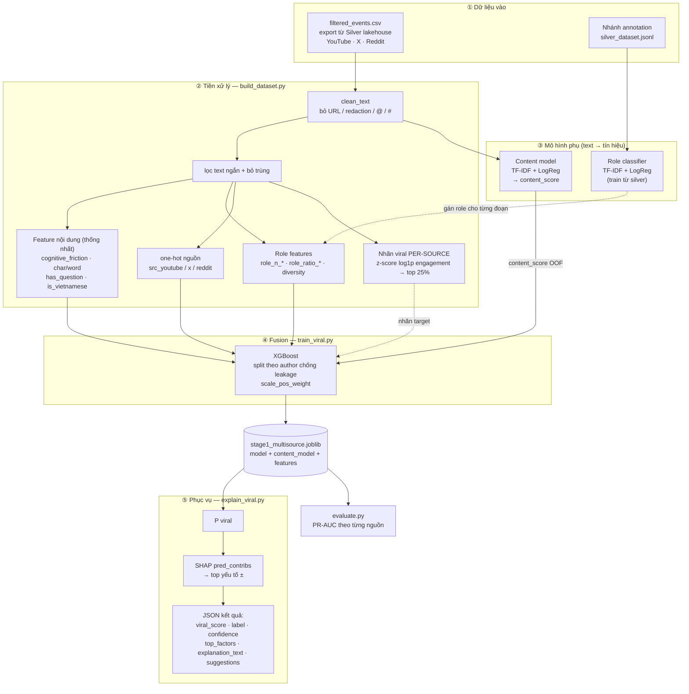
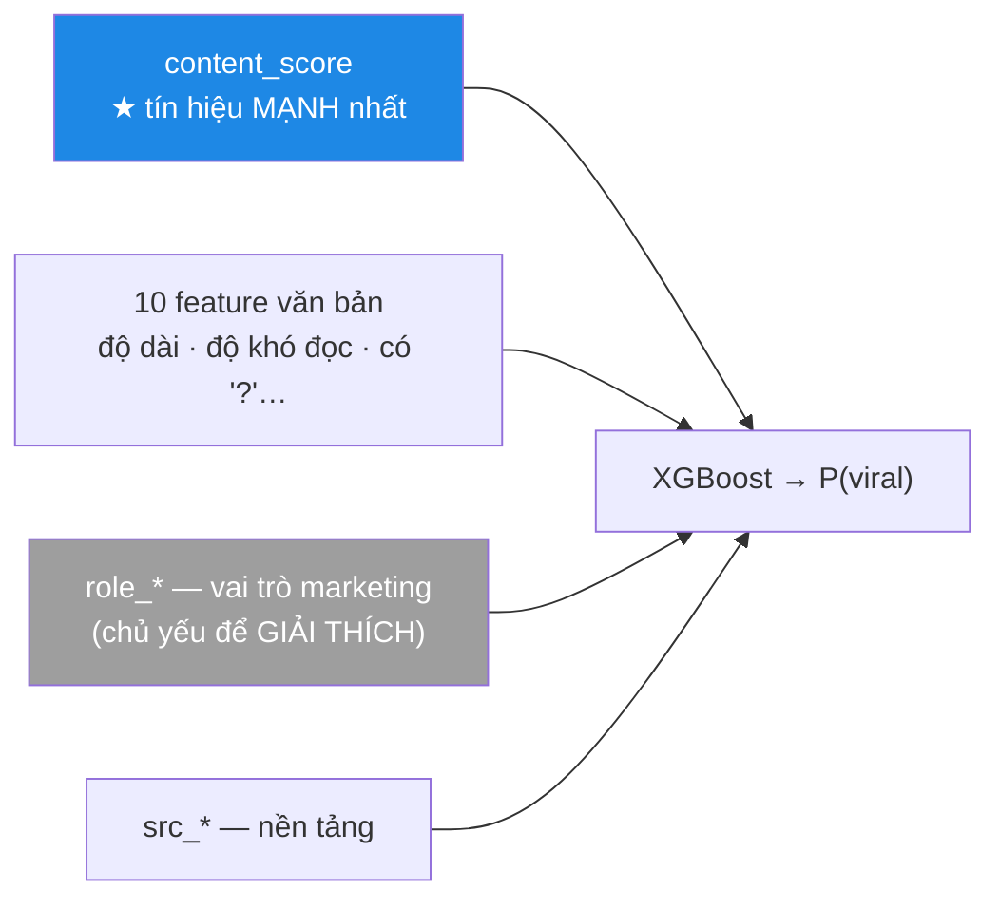
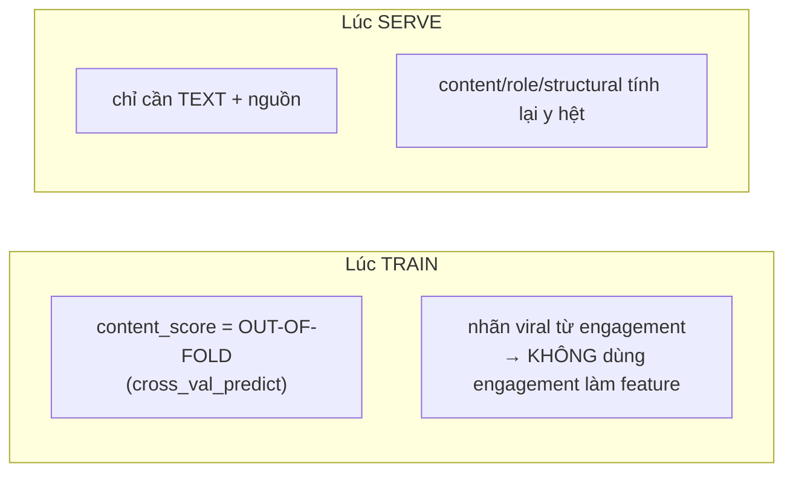

# Kiến trúc phần AI — Dự đoán & giải thích viral (Stage 1)

> Xem đẹp nhất bằng Mermaid preview (VS Code: chuột phải → *Open Preview*, hoặc trên GitHub).

## 1. Toàn cảnh pipeline

## 2. Feature đưa vào XGBoost (và vai trò)

## 3. Quan trọng: train vs serve (chống leakage)

## 4. Hiện trạng (số liệu thật)

| Thành phần | Kết quả |
|---|---|
| Fusion viral (overall) | PR-AUC ~0.48 · ROC ~0.74 |
| └ YouTube | ROC **0.80** (tốt — nhiều data) |
| └ Reddit | ROC 0.62 |
| └ X | ROC **0.49** (≈ ngẫu nhiên — quá ít data) |
| Role classifier | macro-F1 ~0.80 (6/12 vai trò) |
| Content: TF-IDF vs BERT | TF-IDF 0.499 **>** BERT 0.428 (data còn nhỏ) → giữ TF-IDF |

**Chú giải:** nét liền = luồng dữ liệu/feature; nét đứt = quan hệ phụ trợ (nhãn, gán role). Mô hình hiện mạnh ở YouTube, yếu ở X → đòn bẩy chính = **crawl thêm data X/Reddit**.

> Chi tiết kỹ thuật & lịch sử quyết định: `ml/DEV_LOG.md`. Tổng quan code: `ml/README.md`.
