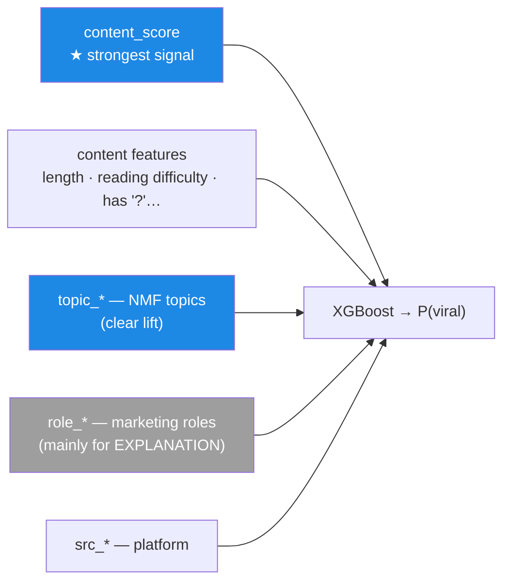
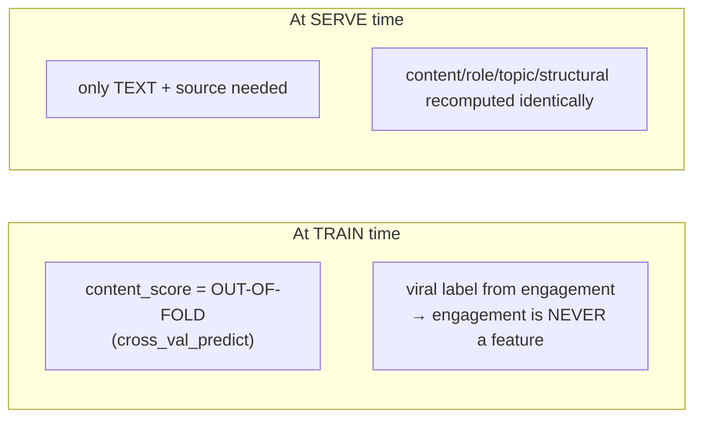

# AI architecture — viral prediction & explanation (Stage 1)

> Best viewed with a Mermaid preview (VS Code: right-click → *Open Preview*, or on GitHub).

## 1. End-to-end pipeline

```mermaid
flowchart TB
  subgraph IN["1. Input data"]
    RAW["filtered_events.csv<br/>exported from the Silver lakehouse<br/>YouTube · X · Reddit"]
    ANN["annotation branch<br/>silver_dataset.jsonl"]
  end

  subgraph PRE["2. Preprocess — build_dataset.py"]
    CLEAN["clean_text<br/>strip URL / redaction / @ / #"]
    FILT["drop short text + duplicates"]
    TXT["Unified content features<br/>cognitive_friction · char/word<br/>has_question · is_vietnamese"]
    ROLE["Role features<br/>role_n_* · role_ratio_* · diversity"]
    TOPIC["Topic features<br/>topic_0..7 (NMF)"]
    SRC["source one-hot<br/>src_youtube / x / reddit"]
    LAB["PER-SOURCE viral label<br/>z-score log1p(engagement) → top 25%"]
  end

  subgraph SUB["3. Sub-models (text → signal)"]
    CM["Content model<br/>TF-IDF + LogReg<br/>→ content_score"]
    RCLS["Role classifier<br/>TF-IDF + LogReg<br/>(trained on silver)"]
    TM["Topic model<br/>NMF over TF-IDF"]
  end

  subgraph FUS["4. Fusion — train_viral.py"]
    XGB["XGBoost<br/>split by author (anti-leakage)<br/>scale_pos_weight"]
  end

  subgraph OUT["5. Serving — explain_viral.py"]
    PRED["P(viral)"]
    SHAP["SHAP pred_contribs<br/>→ top factors ±"]
    JSON["JSON result:<br/>viral_score · label · confidence<br/>top_factors · explanation_text · suggestions"]
  end

  RAW --> CLEAN --> FILT
  FILT --> TXT & ROLE & TOPIC & SRC & LAB
  ANN --> RCLS
  RCLS -.->|assign role per segment| ROLE
  TM -.->|topic distribution| TOPIC
  CLEAN --> CM

  TXT --> XGB
  ROLE --> XGB
  TOPIC --> XGB
  SRC --> XGB
  CM -->|content_score OOF| XGB
  LAB -.->|label (target)| XGB

  XGB --> BUNDLE[("stage1_multisource.joblib<br/>model + content_model + features")]
  BUNDLE --> PRED --> SHAP --> JSON
  BUNDLE --> EVAL["evaluate.py<br/>PR-AUC per source"]
```

## 2. Features fed into XGBoost (and their role)



## 3. Train vs serve (anti-leakage)



## 4. Current status (real numbers)

| Component | Result |
|---|---|
| Fusion viral (overall) | PR-AUC ~0.55 · ROC ~0.76 |
| └ YouTube | ROC **0.79** (good — most data) |
| └ Reddit | ROC 0.76 |
| └ X | ROC **~0.43** (≈ random — too little data) |
| Role classifier | macro-F1 ~0.50 (12 roles) |
| Content: TF-IDF vs BERT | TF-IDF 0.499 **>** BERT 0.428 (data still small) → keep TF-IDF |

**Legend:** solid arrows = data/feature flow; dashed arrows = auxiliary relations (label, role/topic assignment). The model is strong on YouTube/Reddit and weak on X → the main lever is **collecting more X/Reddit data**.

> Technical details & decision history are kept in a local engineering log. Code overview: `ml/README.md`. Handoff for the API/UI tasks: `ml/HANDOFF.md`.
